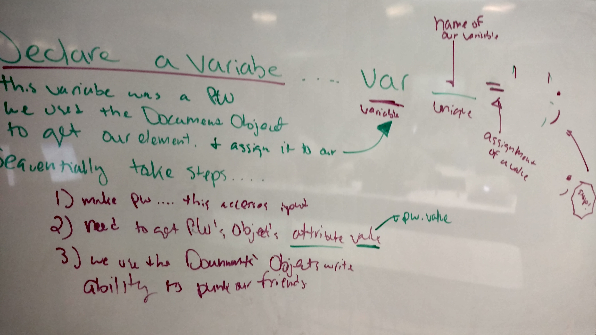

# Intro to Javascript 
JS Workshop Code for 4/21/16

##### Want to learn HTML & CSS? Here are _fantastic_, free resources:
- https://dash.generalassemb.ly/
- http://learn.shayhowe.com/
- https://www.khanacademy.org/computing/hour-of-code/hour-of-html/v/making-webpages-intro

## Employees

1. Employees can be classified under things. Departments?
2. Employees can have skills. They job titles. Pay rate. Etc.
3. So an Employee has... **attributes** (nouns/adjectivies) and **abilities** (verbs/actions)

## Brainstorm

- Attributes - we need 4 attributes
- Abilities - to Manage, to Administrate
- Your goal: identify **4 attributes** that can classify employees.

## Javascript

```js
// anything after the two forward slashes
// is a comment
// this means
// i am ignored by the computer
// notes, hints, frustrations,
// and 42 can go here.
alert('break in 10 minutes');
```

**Why should you not use Alert in production?**

```js
// making a variable
var message = 'Hey jim ur a big dummy';
document.write(message);
var username = prompt('wat is ur name');
```

## Selecting Elements with Javascript



```js
//btCustomPasscode
// mobile password input
// ask the document nicely
// getElementById()
// prompt('like this');
// confirm('my argument');

var pw = document.getElementById('btCustomPasscode');
// new object called pw
// get an ATTRIBUTE called value
// pw.value
document.write('hay i gut ur pw:' + pw.value);
```

## Objects

```js
// we are going make people objects
var donatello = {
  color: 'purple',
  weapon: 'staff',
  pizzaTopping: 'anchovies'
};

donatello.weapon

donatello.kickass()

var magda = {
  age: 13,
  food: 'Fancy Feast',
  color: 'Grey/White',
  breed: 'Tabby'
};

// yourself
// AS AN EMPLOYEE
// name, title, hobby,
// favoriteCity, 
// 7! 
var employee = {
  name: 'James Traver',
  // etc
};
```


